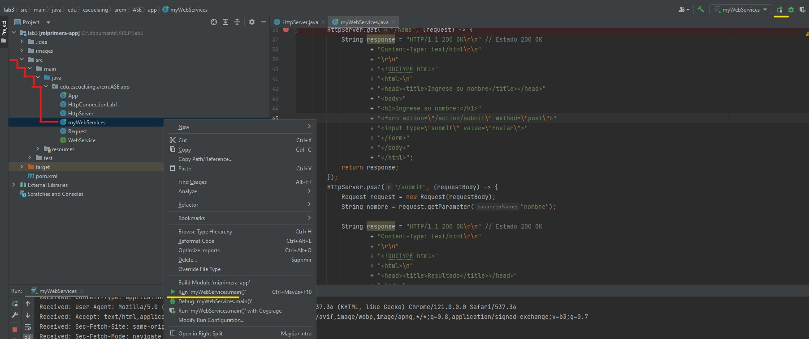
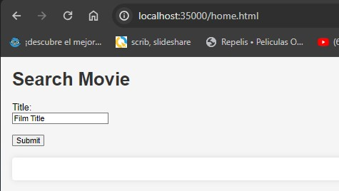
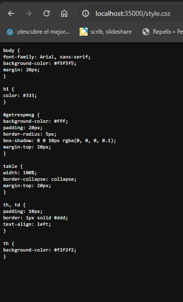
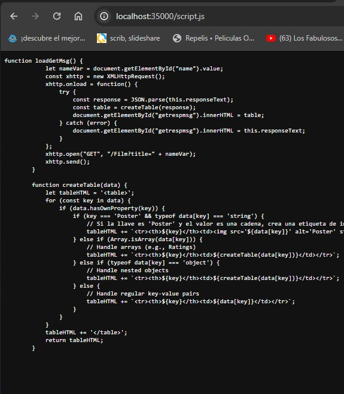
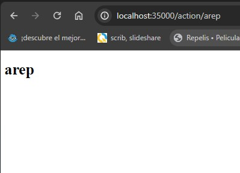
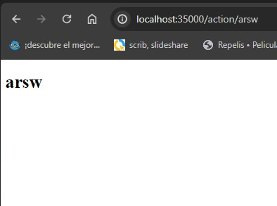
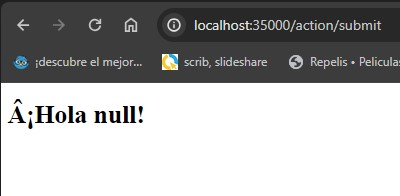

# LAB03 MICROFRAMEWORKS WEB
En este taller se exploró la arquitectura de SparkWeb, un microframework web que simplifica la creación de aplicaciones web mediante el empleo de funciones lambda en Java. A diferencia de otros frameworks como Spark o Spring, se optó por construir un servidor web desde cero, sin recurrir a frameworks externos, utilizando exclusivamente la API básica de Java.

Durante el taller, se desarrolló un servidor web que ofrece funcionalidades similares a las de Spark, implementando servicios web tipo GET y POST mediante funciones lambda. Además, se permitió la entrega de archivos estáticos como HTML, CSS, JavaScript e imágenes.

Una de las características destacadas fue la capacidad de configurar el directorio desde el cual se leerán los archivos estáticos, proporcionando flexibilidad en la organización de los recursos web.

Es relevante señalar que en este taller se hizo hincapié en la construcción del servidor web prescindiendo de frameworks externos como Spark o Spring, utilizando únicamente la API básica de Java para crear un microframework web que satisfaga los requisitos mencionados.

# Instalación 
## Herramientas 
- [MAVEN](https://maven.apache.org) : Para el manejo de las dependecias. 
- [GIT](https://git-scm.com) : Para el manejo de las versiones.
- [JAVA](https://www.java.com/es/) : Lenguaje de programación manejado.
- 
# Empezando
El proyecto incluye una clase encargada de gestionar solicitudes HTTP y enviar las respuestas correspondientes, junto con un mapa de rutas HTTP y sus respectivos manipuladores.

La clase "myWebService" define estas rutas HTTP y sus manipuladores asociados. Sirve como un ejemplo práctico que muestra cómo utilizar la clase "HttpServer" para establecer rutas HTTP personalizadas.

Por otro lado, la interfaz "WebService" representa una función que maneja las rutas HTTP, permitiendo a los desarrolladores definir fácilmente funciones personalizadas para el manejo de estas rutas en el servidor.


+ Para poder correr el laboratorio se clona el repositorio en una máquina local con el siguiente comando
  
    ```
  git clonegithub.com/XxELIngexX/Lab3.git
    ```

+ luego en el ide de preferencia (Intellij) abrilo de la siguiente forma:

  

+ Para ejecutar el laboratrio es la clase [MyWebServices] y desde el ide de prefencia correr la clase mencionada, Luego, ejecute la clase y abra su navegador de confianza. 

# Arquitectura
El proyecto contiene dos clases y una interfaz:

MyWebServices: Es la clase principal con el método main que inicia el servidor web. Este método crea y registra dos servicios web en las rutas /arep y /arsw (solicitudes GET) y /name (solicitud POST).

```
 http://localhost:35000/action/arep
http://localhost:35000/action/arsw
http://localhost:35000/action/name -> redirige a http://localhost:35000/action/submit
```

WebService: Es una interfaz que define el método Handle que todos los servicios web deben implementar. Este método recibe un String como parámetro y devuelve un String con la respuesta HTTP.
La clase HttpServer located en el paquete org.example.Taller02 es responsable de iniciar el servidor web y manejar las solicitudes HTTP.

Cuenta con el método Runstart que crea un ServerSocket en el puerto especificado y escucha solicitudes HTTP. Al llegar una solicitud, extrae la ruta y parámetros y los envía al servicio web correspondiente. Si no existe un servicio registrado en la ruta, devuelve un error 404.

Adicionalmente, el método handleStaticRequest maneja solicitudes de archivos estáticos como HTML, CSS, JS e imágenes. . Crea una respuesta HTTP apropiada y envía el archivo al cliente.
```
http://localhost:35000/home.html
http://localhost:35000/style.css
http://localhost:35000/script.js
```

# pruebas
###  los archivos estáticos traidos del directorio:
+ cargamos un html con "http://localhost:35000/home.html"


+ cargamos un css con "http://localhost:35000/style.html"


+ cargamos un js con "http://localhost:35000/script.html"


### pruebas para el get y el post:
+ cargamos un get con "http://localhost:35000/action/arep"


+ cargamos un get con "http://localhost:35000/action/arsw"


+ cargamos un get con "http://localhost:35000/action/name"


+ cargamos un post con "http://localhost:35000/action/submit"
  la solicitud post se le envia como parametro el nombre, en este caso valor = "null"



# Autor 
CESAR AMAYA GOMEZ
